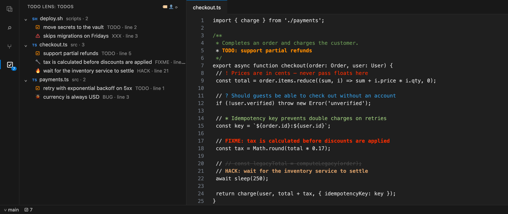
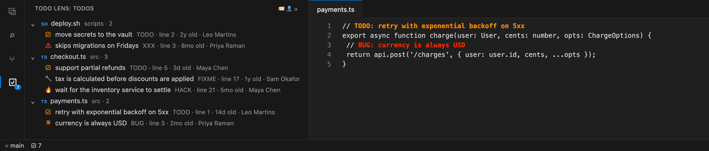

# TODO Lens — Better Comments & TODO Tree

**Make your comments readable and never lose a TODO again.** TODO Lens colors comments by what they mean — alerts, questions, highlights, TODOs, FIXMEs — and collects every TODO in your workspace into one tree.

A fast, **actively maintained** successor to Better Comments, TODO Highlight and TODO Tree, in a single extension.

## Features

### Better comments
Start a comment with a tag and it's colored for you:

| You write | Meaning |
| --- | --- |
| `// ! Prices are in cents` | Alert (red) |
| `// ? Should guests check out` | Question (blue) |
| `// * Idempotency key prevents…` | Highlight (green) |
| `// // old code` | Commented-out code (struck through) |
| `// TODO:` `FIXME` `BUG` `HACK` `XXX` `NOTE` | Tasks (bold, and listed in the TODO tree) |

Works in 60+ languages — `//`, `#`, `--`, `;`, `%`, `<!-- -->`, `/* */` block comments and JSDoc — and ignores tags inside strings (`"http://…"` is not a comment).

### TODO tree
- Every `TODO`, `FIXME`, `BUG`, `HACK` and `XXX` in your workspace, **grouped by file or by tag**.
- Click to jump to it. The list updates as you save, create or delete files.
- Count in the activity bar badge and the status bar.
- Fast: uses the ripgrep engine built into VS Code and respects your `.gitignore`.

## TODO Lens Pro

Pro is part of **Branchline Pro** — a **one-time purchase** (no subscription) that also unlocks Pro in [Branchline — Git Graph](https://marketplace.visualstudio.com/items?itemName=branchline.branchline).

- **TODO age & author** — see who wrote each TODO and how long ago (from git blame). Find the 3-year-old FIXMEs.
- **My TODOs** — one click to show only the TODOs you wrote.
- **Export a TODO report** — a Markdown table of every TODO with author and age, ready for a PR, ticket or standup.

Get Pro from the TODO tree's `…` menu, or run **`TODO Lens: Get TODO Lens Pro`**. Activate it with **`TODO Lens: Enter Pro License Key`**.

## Settings

| Setting | Default | Description |
| --- | --- | --- |
| `todoLens.highlightComments` | `true` | Color tagged comments |
| `todoLens.tags` | built-in set | Custom tags: `{ "tag": "REVIEW", "color": "#C678DD", "bold": true, "todo": true }` |
| `todoLens.exclude` | `[]` | Extra globs to skip (dependencies, build output and `.gitignore`d files are always skipped) |
| `todoLens.maxResults` | `5000` | Max TODOs per workspace folder |
| `todoLens.showStatusBarItem` | `true` | Show the TODO count in the status bar |

## Also by the author

**[Branchline — Git Graph](https://marketplace.visualstudio.com/items?itemName=branchline.branchline)** — a fast, maintained Git Graph: see branches and history, inspect commits, and run git actions from the graph.
- **[Snapline — Code Screenshots](https://marketplace.visualstudio.com/items?itemName=branchline.snapline-code-screenshots)** — beautiful code images in your editor's theme, in one click.

## Support

Free and maintained by one developer. If it saves you time, you can [chip in from $1](https://dealership6.gumroad.com/l/support) — or get Pro, which supports development too.

## Feedback

Bugs and ideas: [GitHub issues](https://github.com/kfirs97/todo-lens/issues). A Marketplace rating helps other developers find TODO Lens.

## License

Source-available under the [TODO Lens License](LICENSE): free to use, read and learn from; redistribution and derivative publications are not permitted.
